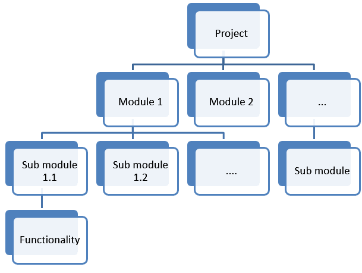

# **Assignment**

## **Task Estimation**

### **Work Breakdown Structures**

**WBS** (Work Breakdown Structure) describes what tasks need to be completed in a project. However, it does not include factors such as timelines or resources. The goal of the WBS is to focus the team on what has to be done.

When you're breaking down what has to be done it is important to remove verbs from each level. You are not describing the tasks necessary to complete what has to be done, you are just describing them. Find out more [here](https://www.guru99.com/an-expert-view-on-test-estimation.html )

Some of the benefits of WBS include:
*   **Project Schedule:** Once you define all the tasks required to complete the project, as well as their hierarchical relationships, it will be much easier to assign resources and set deadlines.
*   **Accountability:** Since all elements in a WBS are mutually exclusive, it helps create accountability. A team assigned to a single work package is solely accountable for its completion. This reduces overlaps in responsibility.
*   **Commitment:** The WBS gives teams a very high-level overview of their responsibilities. Since each team is responsible for a specific component at a time, it helps make them more committed to completing their assigned tasks.
*   **Reduces ambiguities:** WBS involves the project manager, team members and relevant stakeholders. This encourages dialog and so everyone knows exactly what they have to do. This way there is ambiguity.

If you want to read further click [here](https://www.workamajig.com/blog/guide-to-work-breakdown-structures-wbs?hs_amp=true)

